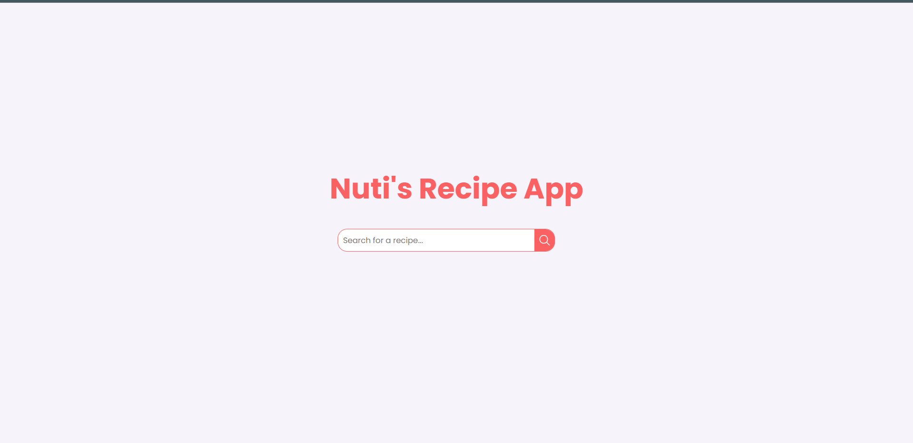
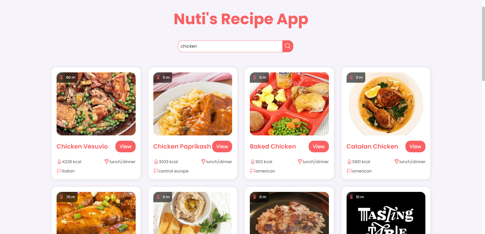
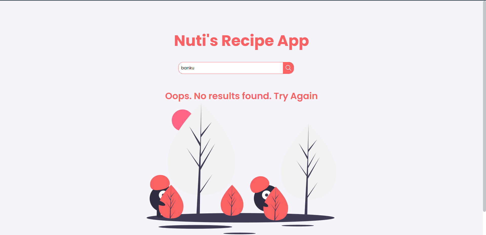

# Nuti's Recipe App
This a food recipe app made with JavaScript. This app uses the [Edamam Recipe API](https://developer.edamam.com/edamam-recipe-api) to fetch recipes and display them.  

## Resources
- [Ionicons](https://ionic.io/ionicons)
- [Edamam](https://www.edamam.com/)
## Live Site
Check out the [live site](https://nutis-recipes.netlify.app/)

## How It Works
- Search for any food item e.g "chicken"
- You will be served with recipes for that food item
- To view more aboubt that recipe, click on the "View More" button

## What I Learnt
- How to use APIs by reading documentation
- A little bit of Async/Await
- Fetching data from API
- A practice of styling with CSS

## How It Looks

